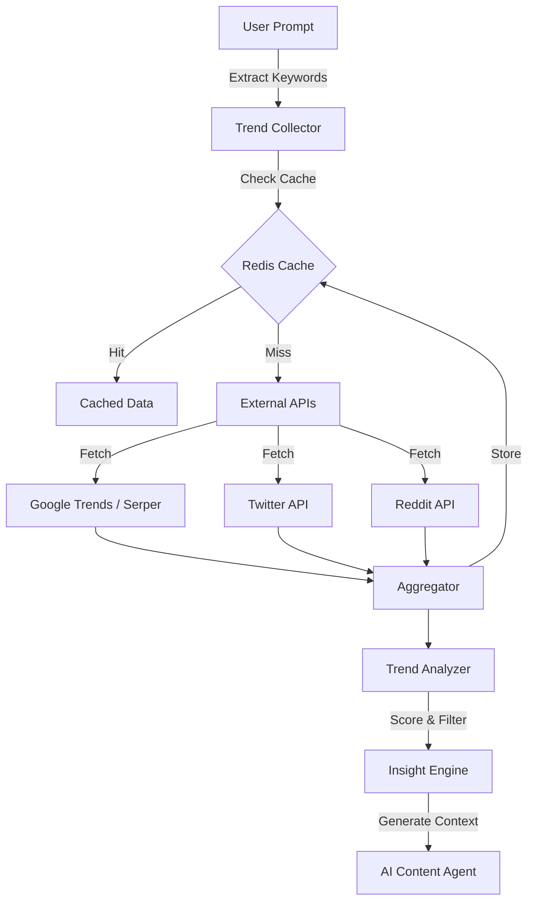

# Trend Analysis Architecture

This document explains how the **Verbix AI** Trend Analysis system works, enabling the platform to generate content that is relevant, timely, and optimized for engagement.

## 🔄 High-Level Workflow

The trend analysis pipeline follows a **Fetch-Analyze-Contextualize** pattern:

1. **Request**: User provides keywords or a prompt (e.g., "Write a blog about AI agents").
2. **Collection**: System fetches real-time data from multiple external sources (Google, Twitter, Reddit).
3. **Analysis**: Data is scored, deduplicated, and analyzed for sentiment and engagement.
4. **Contextualization**: Insights are transformed into a structure that the AI Content Generator uses to guide drafting.



## 🧩 Key Components

### 1. Trend Collector (`intelligence/trend_collector.py`)

Responsible for gathering raw data from external platforms.

- **Multi-Source Fetching**: Runs asynchronous tasks to fetch data concurrently.
  - **Google**: Uses **Serper API** to get search results and "People Also Ask" data.
  - **Twitter/X**: Uses **Twitter API v2** to find recent tweets with high engagement.
  - **Reddit**: Uses **Reddit API** to find "hot" posts in relevant subreddits.
- **Smart Caching**:
  - Uses **Upstash Redis** to cache results for **30 minutes**.
  - Cache keys are generated based on sorted keywords and sources to maximize hit rates.
- **Deduplication**: Removes duplicate topics based on title similarity.

### 2. Trend Analyzer (`intelligence/trend_analyzer.py`)

Responsible for making sense of the raw data.

- **Relevance Scoring Algorithm**:
    Everything is scored on a 0-100 scale based on 5 factors:
    1. **Keyword Match (40%)**: How well the content matches the user's intent.
    2. **Source Credibility (20%)**: News > Search > Social Media.
    3. **Engagement (20%)**: Logarithmic scaling of likes, upvotes, and comments.
    4. **Recency (10%)**: Newer content gets a higher score (< 1 hour = 100 points).
    5. **Quality (10%)**: content length and spam detection.

- **Tone Detection**:
    Analyzes the prompt and trending content to detect tone (e.g., "Professional", "Casual", "Urgent") using keyword density analysis.

### 3. Integration with Content Generation

The analysis is not just a report; it directly influences content generation via `analyze_for_generation`:

- **Target Audience**: Inferred from sources (e.g., LinkedIn -> Professionals, Reddit -> Enthusiasts).
- **Trending Angles**: Extracts common themes from top-performing content.
- **Keywords**: Suggests high-frequency terms found in trending data to improve SEO.

## 🛠️ Configuration

To enable full trend analysis, the following environment variables must be set in `apps/backend/.env`:

```env
# Google Trends (Serper)
SERPER_API_KEY=...

# Twitter/X
TWITTER_API_KEY=...
TWITTER_API_SECRET=...

# Reddit
REDDIT_CLIENT_ID=...
REDDIT_CLIENT_SECRET=...
REDDIT_USER_AGENT=TrendAnalyzer/1.0
```

## 📊 API Endpoints

- `POST /api/v1/trends/analyze`: Full analysis for specific keywords.
- `POST /api/v1/trends/generate-context`: tailored context for the AI writer.
- `GET /api/v1/trends/top`: Quick lookup of top trends.
